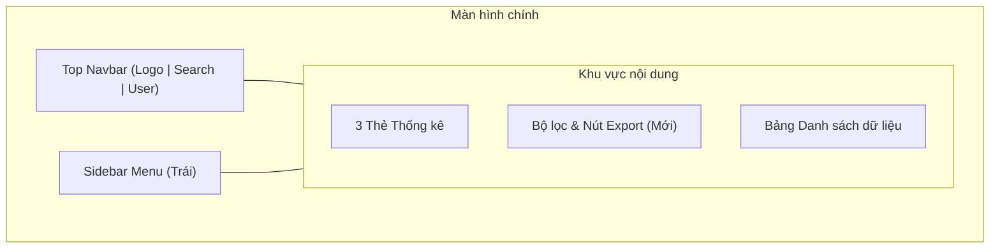

# In-Prompt Wireframe Handover Skill

Skill này bắt buộc agent **vẽ khung Wireframe Lo-Fi trực tiếp ngay trong tin nhắn trả lời (chat/prompt)** bằng **ASCII Box Art / Unicode Grid** hoặc **Mermaid Layout Diagram**. Cực nhẹ, 0 byte file, không mở trình duyệt, xem được ngay tại terminal!

---

## 1. Core Workflow

```
[User Image/URL + Prompt]
          │
          ▼
1. Bóc tách layout từ ảnh/web cũ (Header, Sidebar, Main, Action, Form, Table)
          │
          ▼
2. VẼ KHUNG WIREFRAME TRỰC TIẾP TRONG PROMPT (ASCII Box / Unicode Grid)
          │
          ▼
3. Tóm tắt các khối thay đổi & Dừng lại hỏi ý kiến (Checkpoint)
          │
          ▼
[User Duyệt "OK"] ──► Bắt đầu code vào dự án thật
```

---

## 2. Tiêu chuẩn vẽ khung ngay trong Prompt

### Cách 1: Khung Hộp ASCII / Unicode (Khuyên dùng nhất - Trực quan nhất)
Vẽ rõ ràng kích thước tương đối và vị trí các khối bằng ký tự viền hộp (`┌─┐`, `│ │`, `└─┘` hoặc `+---+`):

```text
┌────────────────────────────────────────────────────────────────────────┐
│ [LOGO]  Home   Products   About               [🔍 Search]   [👤 Profile]│ ◄── Top Navbar
├──────────────┬─────────────────────────────────────────────────────────┤
│ 📁 SIDEBAR   │ 🏠 DASHBOARD / OVERVIEW                                 │
│              ├───────────────────────────┬─────────────────────────────┤
│ • Tổng quan  │ [📊 Metric Card 1]        │ [📈 Metric Card 2]          │
│ • Quản lý    │ Doanh thu: 120M           │ Đơn mới: 45                 │
│ • Cài đặt    ├───────────────────────────┴─────────────────────────────┤
│              │ 📋 BẢNG DỮ LIỆU (Mới: Thêm Filter theo ngày)             │
│ [⚙️ Config]  │ ┌──────┬──────────────┬──────────────┬──────────────┐   │
│              │ │ ID   │ Tên khách    │ Trạng thái   │ Hành động    │   │
│              │ ├──────┼──────────────┼──────────────┼──────────────┤   │
│              │ │ #01  │ Nguyễn Văn A │ [Đã duyệt]   │ [Sửa] [Xóa]  │   │
│              │ └──────┴──────────────┴──────────────┴──────────────┘   │
│              │ [« 1  2  3 »]                              [+ Thêm mới] │
└──────────────┴─────────────────────────────────────────────────────────┘
```

### Cách 2: Sơ đồ Khối Mermaid (Nếu giao diện phức tạp nhiều tầng)
Nếu giao diện gồm nhiều modal hoặc luồng popup, vẽ sơ đồ cấu trúc bằng Mermaid:



---

## 3. Quy tắc Handover Checkpoint (Bắt buộc hỏi trước khi code)

Sau khi vẽ xong khung trong câu trả lời:
1. **Liệt kê nhanh 3-4 gạch đầu dòng**:
   - Khối nào giữ nguyên từ ảnh cũ.
   - Khối nào di dời hoặc thêm mới theo prompt của người dùng.
2. **DỪNG LẠI và hỏi chốt**:
   > *"Khung layout phác thảo trực tiếp ở trên bạn xem đã đúng ý chưa? Cần đổi vị trí khối nào hay thêm bớt gì trước khi mình bắt đầu code thật không?"*
3. **Chỉ khi người dùng gõ duyệt** (ví dụ: "ok", "được rồi", "tiến hành đi") thì mới bắt tay vào code các file dự án.
